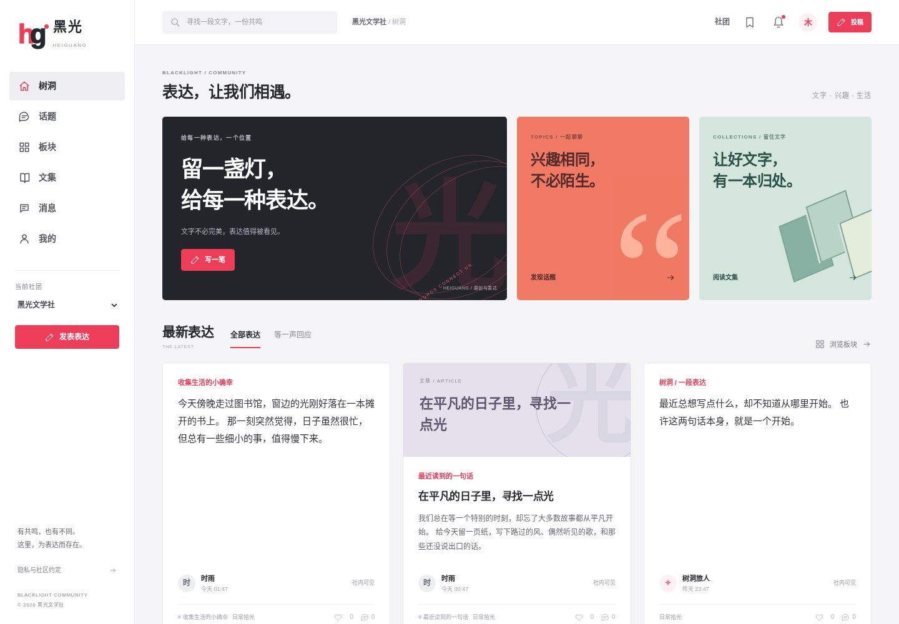
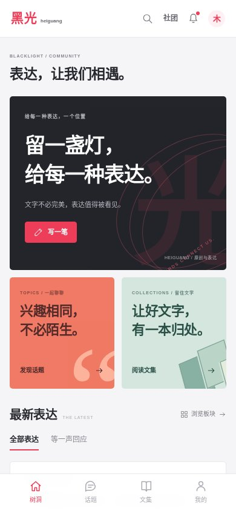
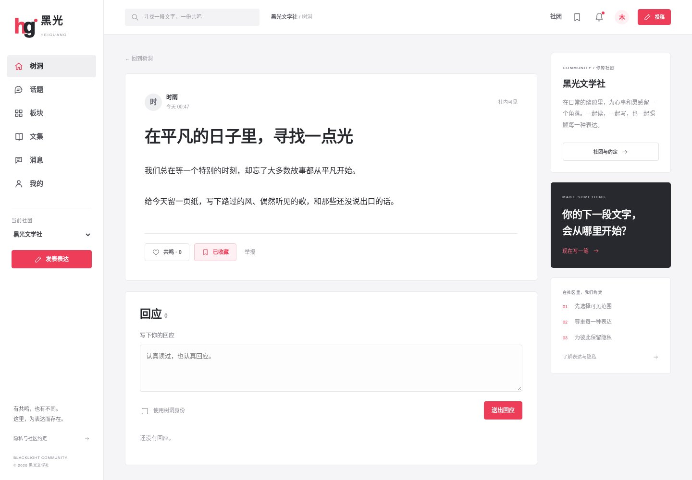
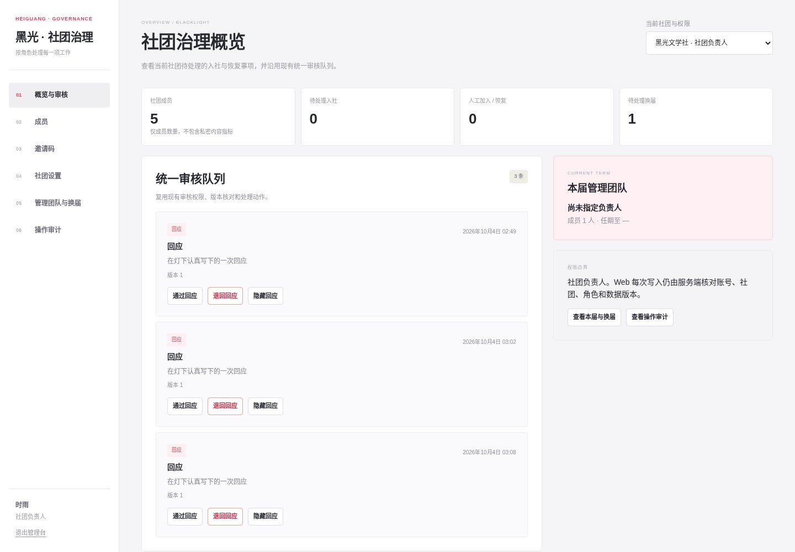

# 新版网站 UI 验收

用户审核通过机核网风格参考的效果图后，将相同视觉接入真实网站。成员端改用紧凑白色导航、灰白卡片、红色强调和内容网格；管理台采用对应配色与排版。主题色与 favicon 同步更新。所有内容来自原 DTO 和接口，示例数据仅位于隔离测试库。

- `npm test`：229 项，227 通过，2 个已有可选数据库用例跳过，0 失败。
- `npm run check` 与 `npm run lint`：通过；原小程序动作引用无漂移。
- 56 个页面与状态 × 1440 px 电脑 / 390 px 手机，共 112 张真实浏览器截图，无 JavaScript 错误及横向溢出。清单见 [pages-manifest.json](pages-manifest.json)。
- 登录、真实搜索、收藏和共鸣往返切换、举报弹窗取消、文章表单限制、私密文章保存与确认删除均通过。测试文章仅保存至隔离 PostgreSQL 并已删除，结果见 [interaction-results.json](interaction-results.json)。
- 360、390、768、1024、1440 px 关键页面通过；60 字连续英文标题、20 字昵称的长文本检查通过。
- 独立审查检查新卡片的转义、匿名作者、媒体 URL、路由、委托事件与响应式布局。修复手机社团入口不可见问题；恢复打印阅读样式与短屏侧栏滚动。对应浏览器验证先失败、修复后通过。
- 发布入口按原有成员状态和发布能力导航；未登录进入登录，受限成员进入成员状态。回归用例先失败、接入新版视图后通过。

源码之外另行交付完整离线图册和原图 ZIP；仓库保留以下代表截图。未合并或公网部署，未修改生产数据库。

