# 产品经理模拟审阅：六项体验优化

基于已验收 UI `0ca1d63`，公开网络搜索选择 Agency Agents 产品经理角色与 pm-skills 的用户旅程、测试场景指南，派遣一个子智能体完成实际 Chromium 审阅。同一子智能体独立复验。任务覆盖新访客、普通成员与管理员的加入、阅读、创作、恢复与回访路径。

方法与指南 URL/内容 SHA256 见 [method.json](method.json)。这是隔离环境的模拟体验审阅，没有真实用户访谈或生产转化数据。维持已审核的视觉方向、账号密码登录及既有权限。

## 修复与验收

| 项目 / 优先级 | 优化 | 最终行为 | 独立复验 |
|---|---|---|---|
| PM-01 / P1 | 后退时保护未提交草稿 | 以前后退后再前进，正文已经消失。现在先确认离开，取消后正文、标题、范围和身份均保留。 | 通过 |
| PM-02 / P1 | 私密作品明确显示已保存 | 识别后端已有的 private_saved 状态，明确提示“已保存，仅自己可见”；社内和公开表达继续按原规则审核。 | 通过 |
| PM-03 / P2 | 登录后继续原任务 | 从收藏或加入页登录后继续原任务；认证页面切换保留意图，站外地址和未知路由不作为返回目标。 | 通过 |
| PM-04 / P2 | 读隐私说明后无需重新填写 | 隐私说明在新标签页打开，原注册表单继续可用；同意勾选仍必需，密码不写入持久存储。 | 通过 |
| PM-05 / P2 | 读完回到原消息或收藏列表 | 详情返回链接对应来源列表与标签；搜索保留查询，直接打开作品默认返回树洞。 | 通过 |
| PM-06 / P2 | 一步取消回复对象 | 增加“取消回复”按钮，仅清除目标，不清空正文或树洞身份选择；取消后可继续回应全文。 | 通过 |

## 验证证据

- `npm test`：234 项，232 通过、2 个已有可选数据库用例跳过，0 失败；见 [unit-final.log](unit-final.log)。
- `npm run check` 和 `npm run lint`：通过；见 [check-final.log](check-final.log)、[lint-final.log](lint-final.log)。
- 新增 5 个单元回归用例先失败后通过，验证安全路由与页面任务；[unit-red.log](unit-red.log) 保留失败证据。
- 8 个实际浏览器体验场景通过，含 360、390、768、1440 px 关键页面、表单保留、真实私密创建与自行删除；见 [acceptance-results.json](acceptance-results.json)。[browser-red.log](browser-red.log) 保留第一阶段修改后仍失败的 5 个场景，[browser-green.log](browser-green.log) 为最终通过。
- 产品经理独立复验 24 个手机/电脑子场景全部通过，JS 错误 0，检查点无横向溢出；见 [pm-recheck-results.json](pm-recheck-results.json)。取消/前进/重复导航、重提、来源返回、匿名保持、隐私与管理员弹窗均覆盖。
- 既有网站烟测完整注册→邀请码申请→管理员批准→成员浏览通过，并覆盖 Cookie 管理入口、回应、私密发布、退出与敏感状态不持久存储；见 [smoke-results.json](smoke-results.json)。

源码验收脚本：`tests/browser/product-experience.mjs` 与 `tests/browser/web-smoke.mjs`，仅允许显式 loopback 测试地址，需本轮隔离夹具。没有重置数据库或修改生产数据；体验回归与独立复验创建的私密验收文章均已自行删除。

## 覆盖边界

独立产品经理复验没有另建注册账号；验证登录后续接与认证标签切换，完整注册由网站烟测覆盖。夹具只有一个社团，第二社团取消分支通过临时浏览器选项触发，不声称成功切换了第二真实社团。只有一条真实一级回应，已验证取消与重新选择目标，不声称不同真实目标间切换。没有真实外部媒体审核调用或新生产部署。

仓库保留六组代表截图。完整初审 37 张和独立复验 32 张截图、原始报告与辅助脚本随离线审阅包交付；JSON 中其余截图名对应该包。优先级和成本为模拟定性判断，不代表运营实测影响。

## 前后截图

### PM-01 · 后退时保护未提交草稿

| 优化前 | 优化后 |
|---|---|
| 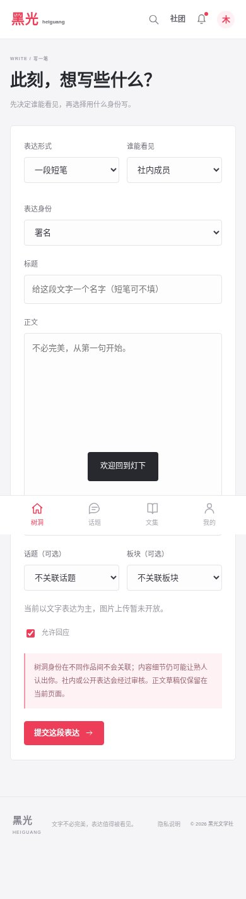 | 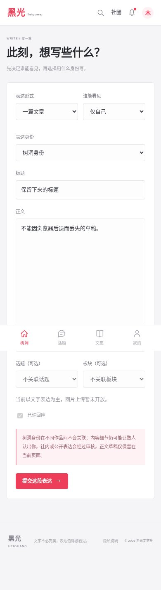 |

### PM-02 · 私密作品明确显示已保存

| 优化前 | 优化后 |
|---|---|
| 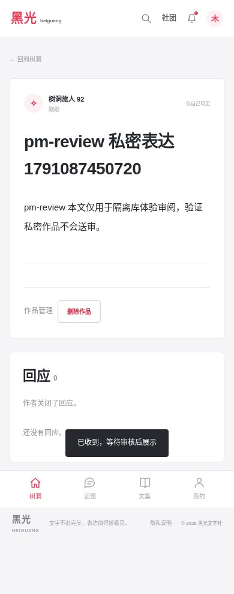 | 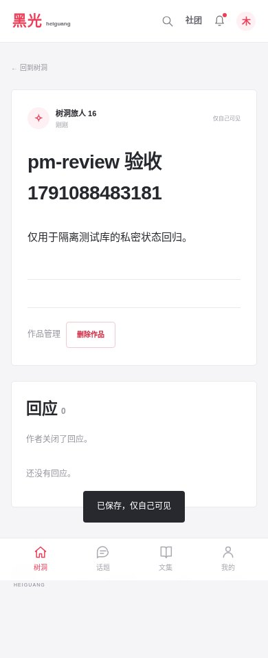 |

### PM-03 · 登录后继续原任务

| 优化前 | 优化后 |
|---|---|
| 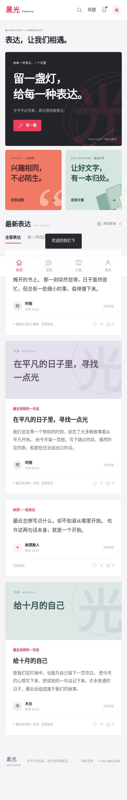 | 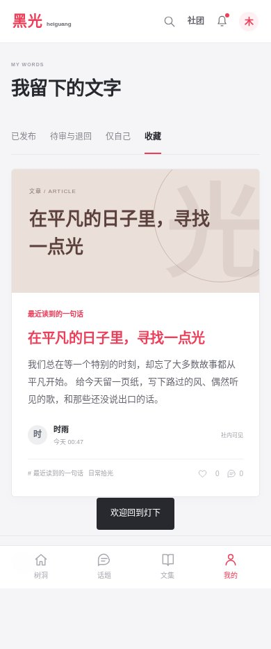 |

### PM-04 · 读隐私说明后无需重新填写

| 优化前 | 优化后 |
|---|---|
| 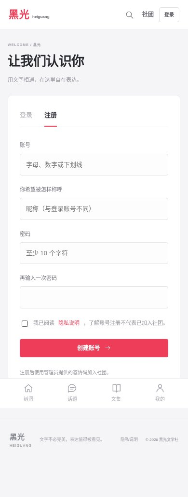 | 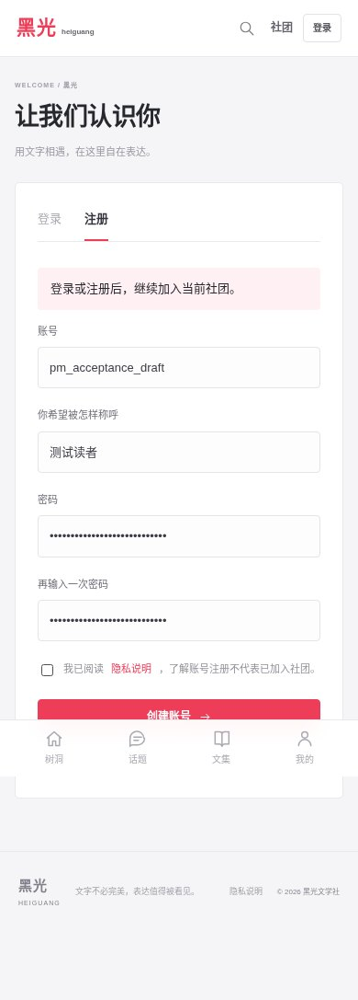 |

### PM-05 · 读完回到原消息或收藏列表

| 优化前 | 优化后 |
|---|---|
| 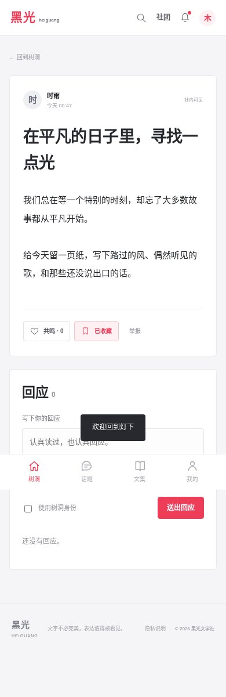 | 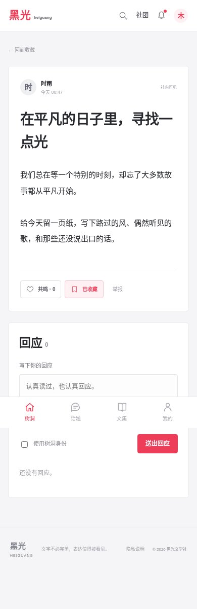 |

### PM-06 · 一步取消回复对象

| 优化前 | 优化后 |
|---|---|
| 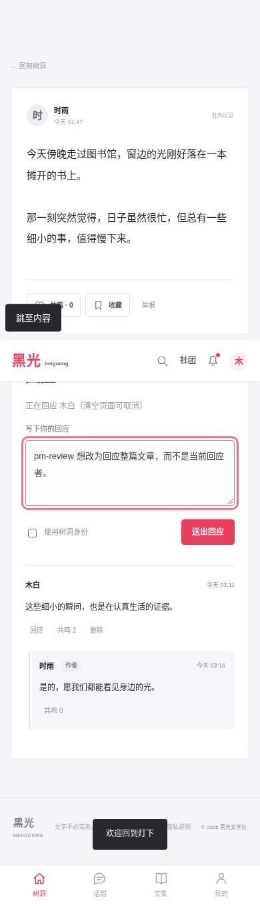 | 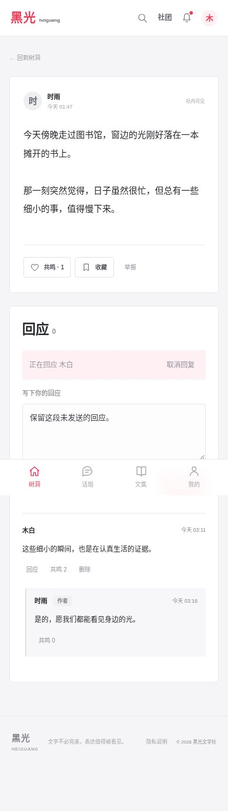 |
